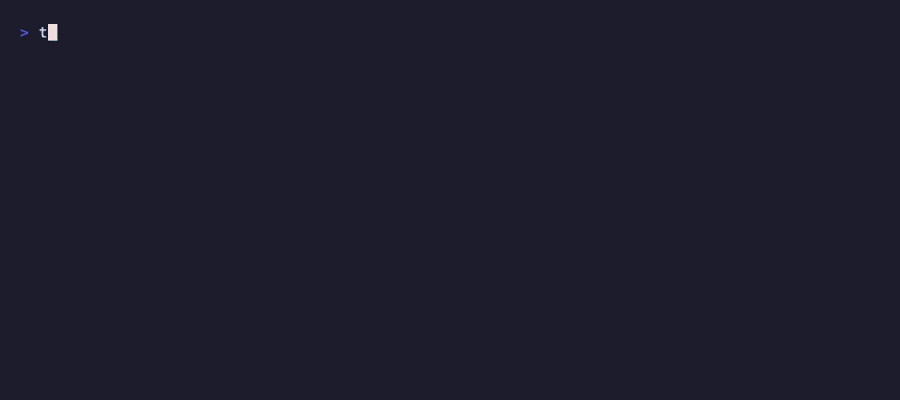
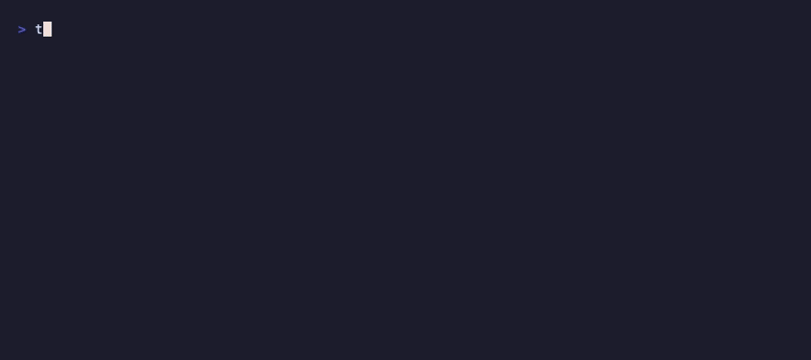

<div align="center">

# txex

**Extract, cache, and transform media from the blockchain.**

[](https://www.npmjs.org/package/txex)
[](https://github.com/b-open-io/txex/blob/master/LICENSE)


</div>

---

## Installation

```bash
npm install -g txex
```

## Table of Contents

- [Features](#features)
- [CLI Usage](#cli-usage)
  - [Basic Extraction](#basic-extraction)
  - [Collections](#collections)
  - [Image Transforms](#image-transforms)
  - [Video Transforms](#video-transforms)
  - [Audio Transforms](#audio-transforms)
  - [Metadata Inspection](#metadata-inspection)
  - [Cache Management](#cache-management)
- [Library Usage](#library-usage)
- [Configuration](#configuration)
- [Supported Protocols](#supported-protocols)
- [Data Providers](#data-providers)

## Features

- **Universal Extraction** - Seamlessly handles B://, BCAT, 1Sat Ordinals, and ORDFS Streams
- **Media Processing** - Resize, crop, format conversion for images (sharp), video, and audio (ffmpeg)
- **Collection Downloads** - Auto-detect and download entire NFT collections in parallel
- **Origin Tracking** - Automatically traces marketplace listings back to their inscription
- **Smart Caching** - Two-tier cache for raw transactions and transformed outputs
- **TypeScript Ready** - Use as CLI or import as a fully-typed library

## CLI Usage

### Basic Extraction

```bash
# Extract from outpoint (txid_vout)
txex <outpoint> -o output.mp4

# Auto-detect filename and extension
txex abc123...def456_0

# Parallel chunk fetches for large files
txex abc123...def456_0 -c 10
```

### Collections



```bash
# Download entire collection (auto-detected)
txex <collection_outpoint>

# Limit number of items
txex <collection_outpoint> --limit 50

# Custom output directory
txex <collection_outpoint> -o ./my-collection
```

### Image Transforms



```bash
# Resize to width, convert to WebP
txex <outpoint> -w 800 -f webp -o thumb.webp

# Generate blurred placeholder
txex <outpoint> -w 50 --blur 10 -f webp -q 50

# Social media card (Cover fit, specific dimensions)
txex <outpoint> -w 1200 -h 630 --fit cover -f webp -o og.webp
```

#### Transform Options

| Option | Short | Description |
|--------|-------|-------------|
| `--width <px>` | `-w` | Resize width |
| `--height <px>` | `-h` | Resize height |
| `--format <fmt>` | `-f` | Output format: `webp`, `avif`, `png`, `jpg` |
| `--fit <mode>` | | Resize fit: `cover`, `contain`, `fill`, `inside` |
| `--quality <n>` | `-q` | Output quality 1-100 (default: 80) |
| `--blur <radius>` | | Blur radius 0.3-1000 |
| `--grayscale` | | Convert to grayscale |
| `--rotate <deg>` | | Rotate degrees |
| `--flip` | | Flip vertically |
| `--flop` | | Flip horizontally |

### Video Transforms

Requires [ffmpeg](https://ffmpeg.org/download.html) installed.

```bash
# Extract thumbnail at 5 seconds
txex <outpoint> --thumbnail 5 -w 320 -o thumb.jpg

# Convert to WebM, resize, trim to 10 seconds
txex <outpoint> -w 720 -f webm --duration 10 -o clip.webm

# Extract GIF preview (first 3 seconds, 10fps)
txex <outpoint> -w 480 -f gif --duration 3 --fps 10 -o preview.gif

# Strip audio
txex <outpoint> -f mp4 --no-audio -o silent.mp4
```

#### Video Options

| Option | Description |
|--------|-------------|
| `--thumbnail <time>` | Extract frame at timestamp (e.g., `5` or `00:00:05`) |
| `--thumbnail-format` | Thumbnail format: `jpg`, `png`, `webp` (default: jpg) |
| `--start <time>` | Trim start time |
| `--duration <time>` | Trim duration |
| `--fps <n>` | Output frames per second |
| `--no-audio` | Strip audio track |
| `-f <fmt>` | Output format: `mp4`, `webm`, `gif`, `mov` |

### Audio Transforms

Requires [ffmpeg](https://ffmpeg.org/download.html) installed.

```bash
# Convert to different format
txex <outpoint> -f ogg -o track.ogg

# High quality MP3 with bitrate
txex <outpoint> -f mp3 --bitrate 320k -o track.mp3

# Trim audio (start at 10s, 30s duration)
txex <outpoint> --start 10 --duration 30 -f mp3 -o clip.mp3

# Normalize volume and convert to mono
txex <outpoint> --normalize --channels 1 -f wav -o normalized.wav
```

#### Audio Options

| Option | Description |
|--------|-------------|
| `-f <fmt>` | Output format: `mp3`, `wav`, `ogg`, `flac`, `aac`, `m4a` |
| `--bitrate <rate>` | Bitrate (e.g., `128k`, `320k`) |
| `--sample-rate <hz>` | Sample rate (e.g., `44100`, `48000`) |
| `--channels <n>` | Channels: `1` (mono), `2` (stereo) |
| `--start <time>` | Trim start time |
| `--duration <time>` | Trim duration |
| `--normalize` | Normalize volume level |

### Metadata Inspection

```bash
# Show metadata without extracting
txex info <outpoint>

# JSON output for scripting
txex info <outpoint> --json
```

Output includes: protocol, media type, size, filename, chunk count, origin (if different), and satoshis.

### Cache Management

```bash
txex cache --stats   # Show cache statistics
txex cache --clear   # Clear all cached data
```

## Library Usage

`txex` is fully typed. Install it locally:

```bash
npm install txex
```

```typescript
import { extract, extractData, transformImage } from "txex";

// Get full file info
const file = await extract("abc123...def456_0");
console.log(file.protocol);   // "bcat" | "b" | "ord" | "stream"
console.log(file.mediaType);  // "video/mp4"
console.log(file.data);       // Uint8Array
console.log(file.chunks);     // Number of chunks (for BCAT/stream)

// Get raw data only
const data = await extractData("abc123...def456_0");

// Transform an image
const transformed = await transformImage(data, {
  width: 800,
  format: "webp",
  quality: 85,
});
```

### Ordinal Chain Tracking

```typescript
import { findOrigin, getNextOrdinalOutpoint, streamContent } from "txex";

// Find the origin inscription of a listing/transfer
const origin = await findOrigin({ txid: "abc123...", vout: 0 });

// Get next outpoint in chain (follows spends)
const next = await getNextOrdinalOutpoint({ txid: "abc123...", vout: 0 });

// Stream content chunks (async generator)
for await (const chunk of streamContent({ txid: "abc123...", vout: 0 })) {
  console.log(chunk.mediaType, chunk.data.length);
}
```

## Configuration

Create `.txexrc` or `txex.config.json` in your project or home directory:

```json
{
  "concurrency": 10,
  "transform": {
    "format": "webp",
    "quality": 85
  }
}
```

### Caching

txex uses a two-tier caching system:

1. **Transaction cache**: Raw tx data stored in `~/.txex/cache/tx/`
2. **Transform cache**: Processed images stored in `~/.txex/cache/transformed/`

```bash
txex abc123_0 -w 800 -f webp    # First run: ~2.5s (network fetch)
txex abc123_0 -w 800 -f webp    # Cached: ~0.05s
txex abc123_0 -w 400 -f png     # Different transform: ~0.3s (tx cached)
```

## Supported Protocols

| Protocol | Prefix | Description |
|----------|--------|-------------|
| **B://** | `19HxigV4QyBv3tHpQVcUEQyq1pzZVdoAut` | Single transaction files |
| **BCAT** | `15DHFxWZJT58f9nhyGnsRBqrgwK4W6h4Up` | Chunked files (large media) |
| **Ordinals** | `OP_FALSE OP_IF "ord"...` | 1Sat inscriptions |
| **ORDFS Stream** | `ordfs/stream` content type | Streaming across ordinal transfers |

## Data Providers

txex uses [JungleBus](https://junglebus.gorillapool.io) for transaction data. No API key required.

Collection metadata is fetched from [GorillaPool's Ordinals API](https://ordinals.gorillapool.io).

## License

MIT
